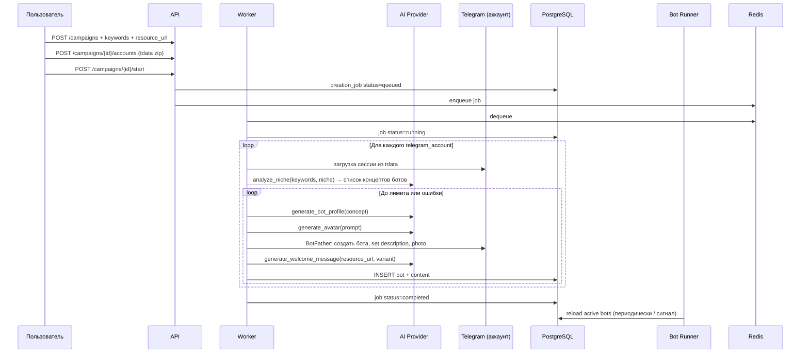

# Архитектура: Telegram Bots Auto Generating

Веб-приложение для массового создания однотипных Telegram-ботов по ключевым словам и ниши пользователя, с генерацией контента через бесплатные/локальные AI-провайдеры.

## Цели

1. Загрузка Telegram-аккаунтов (сессии **tdata**, архив ZIP).
2. Ввод ключевых слов, ссылки на основной ресурс и описания ниши.
3. На каждом аккаунте — создание **максимально возможного** числа ботов (лимит Telegram ~20 на аккаунт; фактическое число зависит от аккаунта).
4. Для каждого бота — AI: название, описание, аватар, уникальный текст приветствия со ссылкой.
5. Хранение ботов и кампаний в **PostgreSQL**.
6. **Один процесс** обслуживает всех ботов (общая логика: ответ с ссылкой на ресурс, текст слегка различается).
7. Вход на сайт — **фиксированный пароль** из `ADMIN_PASSWORD` (env).

---

## Компоненты (процессы)

```
┌─────────────┐     ┌──────────────┐     ┌─────────────────┐
│  Frontend   │────▶│  API (FastAPI)│────▶│   PostgreSQL    │
│  Vue 3      │     │  :5000        │     │                 │
└─────────────┘     └───────┬──────┘     └────────▲────────┘
                            │                        │
                     Redis  │ (очередь задач)        │
                            ▼                        │
                    ┌──────────────┐                 │
                    │   Worker     │─────────────────┘
                    │ (создание    │
                    │  ботов)      │
                    └──────┬───────┘
                           │ Telethon + BotFather
                           ▼
                    ┌──────────────┐
                    │  Bot Runner  │  ← один процесс, aiogram
                    │  (polling)   │     все активные токены
                    └──────────────┘
```

| Сервис | Роль |
|--------|------|
| **api** | REST: авторизация, кампании, загрузка tdata, статус задач, список ботов |
| **worker** | Фоновые задачи: разбор tdata → сессия → AI-план → создание ботов → запись в БД |
| **bot-runner** | Единый event loop: polling всех `status=active` ботов, маршрутизация по `bot_id` |
| **postgres** | Кампании, аккаунты, боты, задачи, сгенерированный контент |
| **redis** | Очередь задач worker + кэш сессий (опционально) |

---

## Поток данных (создание ботов)



---

## AI (бесплатный стек)

Абстракция `app/infrastructure/ai/provider.py`:

| Задача | Провайдер по умолчанию | Альтернатива |
|--------|------------------------|--------------|
| Текст (ниша, имена, описания, сообщения) | **Groq** (`llama-3.3-70b-versatile`, бесплатный tier + API key) | **Ollama** локально (`OLLAMA_BASE_URL`) |
| Изображение (аватар бота) | **Pollinations.ai** (без ключа, HTTP) | Hugging Face Inference (опционально) |

Переключение: `AI_TEXT_PROVIDER=groq|ollama`, `AI_IMAGE_PROVIDER=pollinations`.

Структурированный вывод — JSON-схемы в промптах + парсинг ответа (с повтором при ошибке).

---

## Telegram

### Аккаунты (tdata)

- Пользователь загружает ZIP с папкой `tdata`.
- API сохраняет в volume `storage/tdata/{account_id}/`.
- Worker конвертирует tdata → Telethon session (`app/infrastructure/telegram/session_loader.py`).
- Создание ботов — автоматизация диалога с **@BotFather** через user-клиент (не Bot API).

### Обслуживание ботов (один процесс)

- `bot-runner` загружает из БД все записи `bots` где `status = 'active'` и `token_encrypted` задан.
- **aiogram 3**: один `asyncio` loop, для каждого токена — `Bot` + общий `Router` с фильтром по `bot.id` или middleware, подставляющим `welcome_message` из БД.
- Обработчик: `/start`, любое сообщение → текст из `bot.welcome_message` (уже с уникальной формулировкой и ссылкой на `campaign.resource_url`).
- Hot-reload: каждые N секунд или по Redis pub/sub `bots:reload` — перечитать список токенов, добавить/убрать polling tasks.

---

## Модель данных (PostgreSQL)

См. `database/init.sql`. Кратко:

- **campaigns** — ниша, ключевые слова, URL ресурса, статус.
- **telegram_accounts** — привязка к кампании, путь tdata, лимит/факт числа ботов, статус сессии.
- **bots** — токен (шифрование), username, метаданные, `welcome_message`, статус.
- **creation_jobs** — очередь: прогресс, ошибки, лог.
- **ai_generations** — аудит промптов/ответов (опционально, для отладки).

Таблица `users` из шаблона **не используется** — только admin-пароль.

---

## API (v1)

| Метод | Путь | Описание |
|-------|------|----------|
| POST | `/auth/login` | `{ "password": "..." }` → JWT |
| GET | `/auth/me` | Проверка сессии |
| GET/POST | `/campaigns` | Список / создание кампании |
| GET | `/campaigns/{id}` | Детали + счётчики ботов |
| POST | `/campaigns/{id}/accounts` | multipart: tdata ZIP |
| POST | `/campaigns/{id}/start` | Запуск creation_job |
| GET | `/jobs/{id}` | Статус и прогресс |
| GET | `/campaigns/{id}/bots` | Список созданных ботов |

Все эндпоинты (кроме login/health) — `Authorization: Bearer <JWT>`.

---

## Безопасность

- `ADMIN_PASSWORD` — единственный вход; хранить только в env.
- `JWT_SECRET_KEY` — подпись токенов.
- `BOT_TOKEN_ENCRYPTION_KEY` — Fernet для токенов ботов в БД.
- tdata — только на сервере, volume с ограниченными правами.
- CORS — только `FRONTEND_URL`.

---

## Структура backend

```
backend/app/
├── api/v1/           # auth, campaigns, jobs, bots, health
├── bot_runner/       # main.py — единый polling
├── workers/          # creation_worker.py — очередь Redis
├── domain/
│   ├── models/       # Pydantic DTO
│   └── services/     # campaign_service, bot_service, job_service
├── infrastructure/
│   ├── ai/           # provider, groq, ollama, pollinations
│   ├── telegram/     # session_loader, botfather_client
│   └── database/
└── config.py
```

---

## Frontend (этапы)

1. **Сейчас**: вход по паролю, заглушка дашборда «кампании».
2. **Далее**: форма кампании (keywords, niche, URL), drag-and-drop tdata, прогресс job, таблица ботов.

---

## Docker Compose

- `postgres` — контейнер PostgreSQL 16, схема из `database/init.sql` при первом старте volume.
- `api`, `worker`, `bot-runner` — один образ `backend`; **entrypoint** ждёт Postgres и повторно применяет `init_db` (идемпотентно) перед запуском процесса.
- Postgres на хосте: порт **5433** (`DB_HOST_PORT`), чтобы не конфликтовать с локальным PostgreSQL на 5432.
- Volume `tdata_storage` для сессий.
- `redis` — очередь задач worker.

```bash
docker compose up -d --build
```

---

## Ограничения и риски

- Автоматизация BotFather может ломаться при изменении UI Telegram; нужны retry и ручной fallback.
- tdata привязан к устройству/версии клиента — тестировать конвертацию (opentele / Telethon).
- Лимит 20 ботов — ориентир; worker останавливается при ошибке лимита или блокировке.
- Бесплатные AI имеют rate limits — worker с backoff и очередью.

---

## Порядок реализации

1. ✅ Схема БД, конфиг, auth по паролю, каркас модулей (текущий коммит).
2. API кампаний + загрузка tdata.
3. AI provider (Groq + Pollinations).
4. Worker: сессия + BotFather + сохранение ботов.
5. Bot runner: multi-bot polling.
6. Frontend: полный UI кампании.
